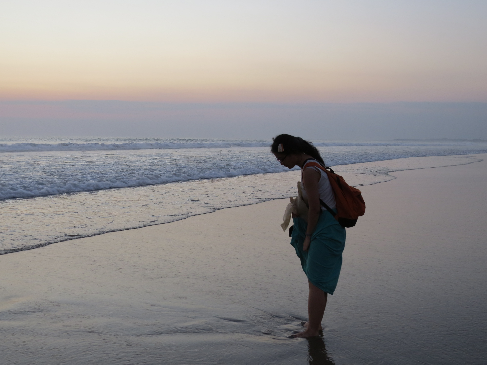

## Welcome to my website!  

My name is **Chiung-Yu Chang**, written as **張瓊予** in Mandarin Chinese. I also use the name **Lisa Chang** frequently.  
I am interested in psycho-/neurolinguistics and cognitive neuroscience. My recent research has focused on speech perception and lexical access. ->[More about me](about.html) and my [research projects](research.html).

 